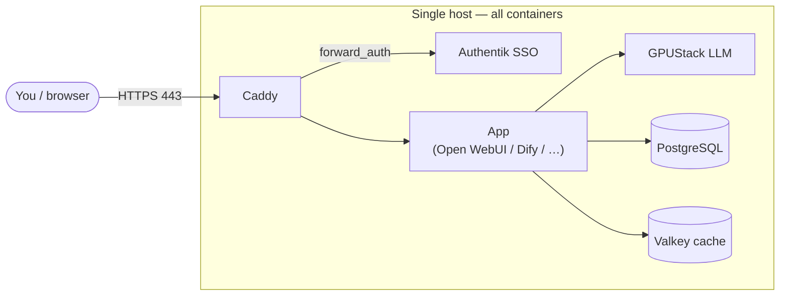
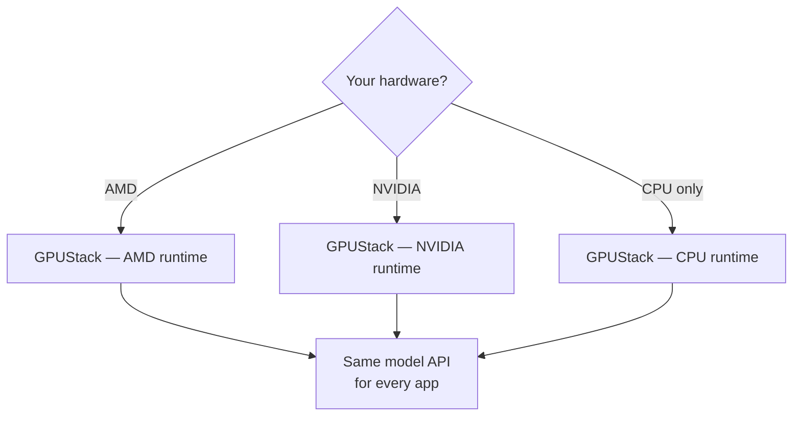

<!-- section: concepts -->
<!-- audience: end-user -->
# Architecture overview

The rzfz.ai Stack — the integrated open-source stack for local AI infrastructure —
is built around a few simple ideas: one front door, a small always-on core, and a
set of modules you switch on as you need them. This page is a conceptual overview
to help you build a mental model of how the stack fits together. It is
understanding-oriented; if you want to install, start with
[Community install](community-install.md).

## One front door, many services

Everything runs as Docker containers on a single host, started and stopped at the
**module** level via Docker Compose *profiles*. There is exactly **one** external
entry point — **Caddy** — which terminates TLS and enforces single sign-on through
**Authentik**. Every database and internal service binds to `127.0.0.1` only, so
nothing else is reachable from the network. You reach an app by name on a subdomain
of your base domain (`chat.<domain>`, `dify.<domain>`, `auth.<domain>`, …), and
that request always arrives through Caddy.

*The request flow: your browser reaches Caddy over HTTPS; Caddy checks with
Authentik that you're allowed in, then forwards you to the app; the app calls
GPUStack for model inference and PostgreSQL/Valkey for state.*

## The module / profile system

Capabilities are grouped into **modules**, and each module maps to a Docker Compose
**profile**. You choose which profiles are active (at install, or later from the
Configuration portal), and only those containers run. This keeps the footprint
small — you enable chat, workflows, monitoring, search, speech, document tools, or
agents individually, from a catalogue of around **25 optional modules**.

A few representative profiles:

| Profile | What it adds |
|---|---|
| `chat` | Open WebUI — the AI chat interface |
| `dify` | Dify — workflow / LLM-app automation |
| `llm` (and stable variants) | GPUStack — local LLM inference |
| `monitor` | Container monitoring UI |
| `searxng` | Private metasearch (a web-search backend for chat and workflows) |
| `gitea` | Self-hosted Git |

The LLM profiles are **mutually exclusive** — exactly one is active at a time,
chosen to match your hardware (see [LLM inference](#llm-inference-at-a-high-level)).

## The always-on core

A small set of services runs regardless of which modules you enable — the
foundation everything else builds on:

- **Caddy** — the only process listening on ports 80/443. It terminates TLS and is
  the single-sign-on gate for every app.
- **PostgreSQL** — one database server, with a **separate database per service**
  (identity, chat, workflows, LLM management, and so on).
- **Authentik** — the identity provider: it logs everyone in and decides who can
  reach which app.
- **Valkey** — a shared cache and queue; each consumer uses its own logical
  database index.
- **SMTP relay** — internal-only outbound mail for notifications and password-reset
  emails.

Because state is consolidated into one PostgreSQL server and one cache, the whole
stack has a small, uniform footprint and is straightforward to reason about.

## Two networks

The stack uses two Docker networks:

- **`default`** — the bridge network that all services share, so they can address
  each other.
- **`ssrf_proxy_network`** — an **internal, SSRF-isolated** network. Some modules
  need to make outbound HTTP requests (for example, fetching a URL a user pasted).
  Those requests are funnelled through a controlled proxy that Caddy runs, so an
  app can't be tricked into reaching internal addresses it shouldn't. This
  server-side request forgery (SSRF) isolation is a deliberate boundary between
  "apps that fetch things" and "the rest of the network."

## How services talk to each other

Inside the host, services find each other by **container name** using Docker's
built-in DNS — an app connects to `postgres`, `valkey`, `gpustack`, and so on by
name, over the internal network. Nothing has to know an IP address, and none of
these internal ports are exposed outside the host. The only names that resolve from
*outside* are the public subdomains, and those all point at Caddy.

## Caddy + Authentik: the single front door

Two things always sit between you and any app:

1. **Caddy** receives the HTTPS request on 443 and terminates TLS.
2. **Authentik** answers Caddy's authentication check (`forward_auth`). If you have
   a valid session and are allowed to reach that app, Caddy forwards you in;
   otherwise you're sent to log in.

The effect is **single sign-on**: you authenticate once with Authentik and then
move between chat, workflows, LLM management, and the rest without logging in again.
It also means there is exactly **one** place that enforces access — one TLS
configuration, one login gate — rather than each app rolling its own.

## LLM inference at a high level

Local language models are served by **GPUStack**, and every model-consuming app —
chat, workflows, agents, retrieval — talks to that **same** GPUStack endpoint. So
whatever GPUStack is serving is what all the apps see.

Which GPUStack *runtime* runs depends on your hardware, selected at install:

The models you chat with are the same regardless of runtime — the runtime is *how*
they're served, not *which* models. Apps reach them through a shared,
OpenAI-compatible model API.

## Why it's built this way

- **Self-hosted and private** — data and models stay on your host; nothing leaves
  it unless a module is explicitly configured to reach out.
- **Single front door** — one place to secure, one TLS config, one SSO gate.
- **Modular** — enable only what you need; each module is an isolated container.
- **Shared infrastructure** — one database, one cache, one mail relay keeps the
  footprint small.

## Next

- **[Getting started](getting-started.md)** — prerequisites and the quickstart.
- **[Community install](community-install.md)** — install the stack yourself.
- **Enterprise documentation → [docs.rzfz.ai](https://docs.rzfz.ai)** — the deeper,
  operational architecture (data-flow detail, upgrades, hardening, compliance) is
  part of the rzfz.ai Subscription.
